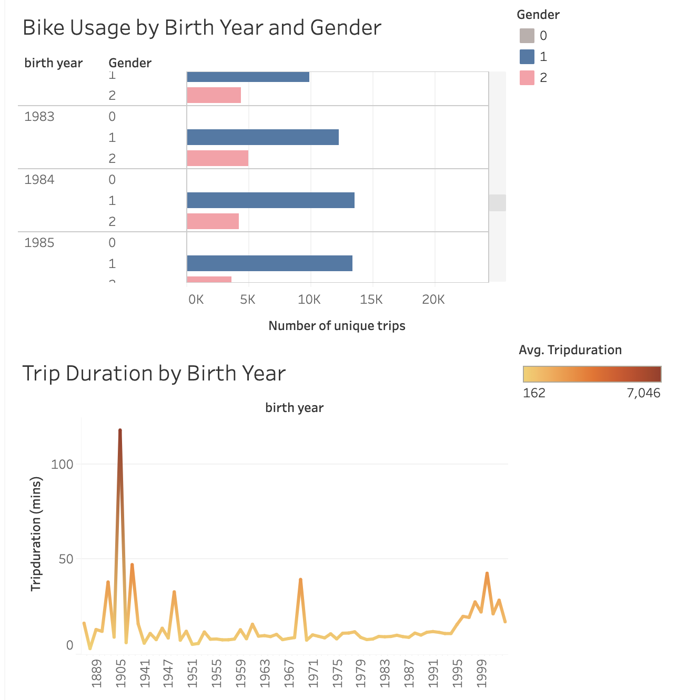
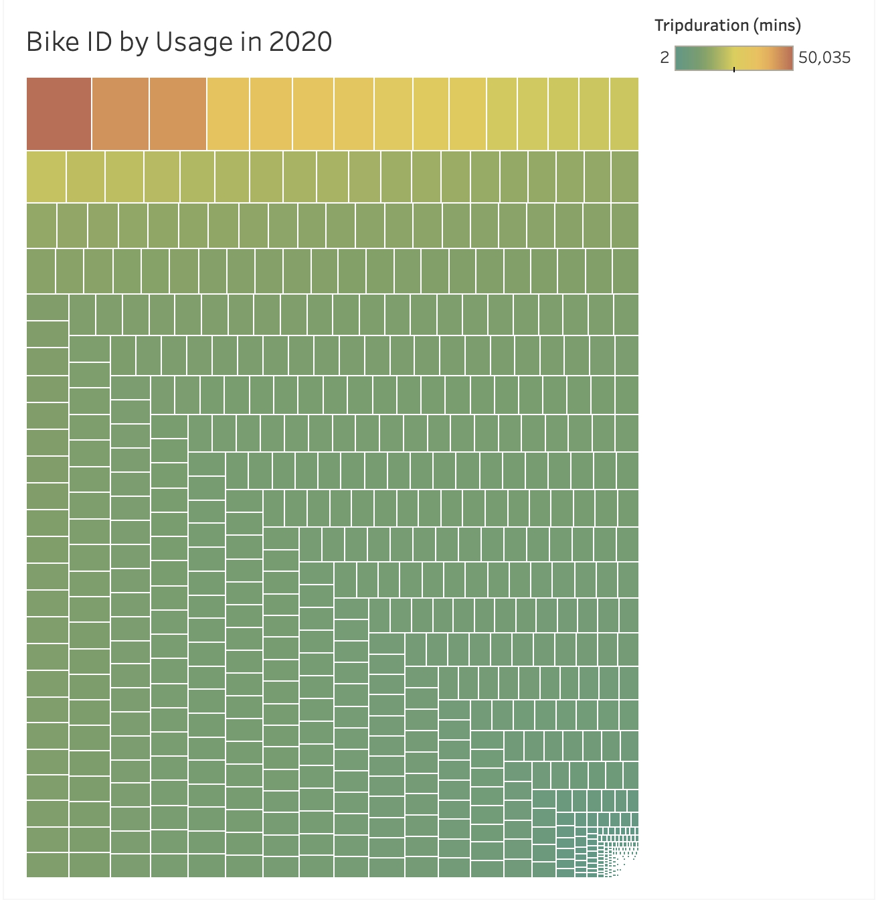
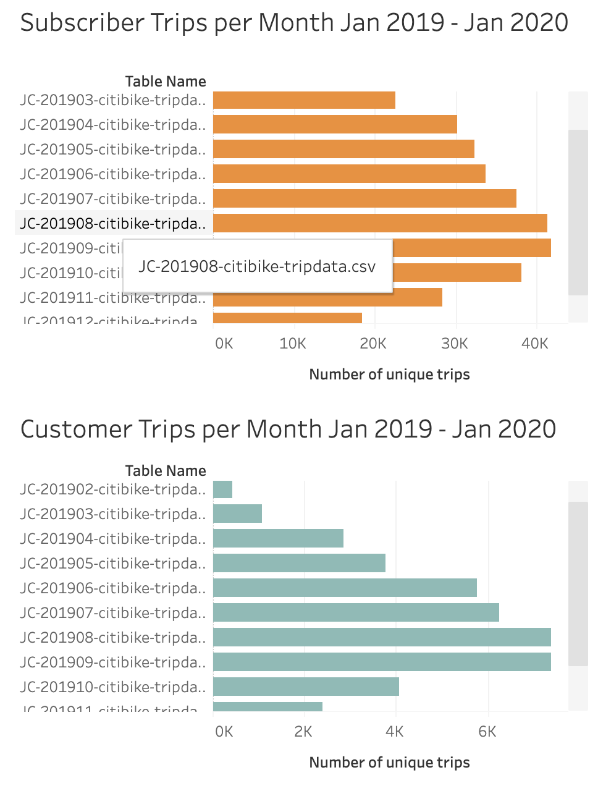
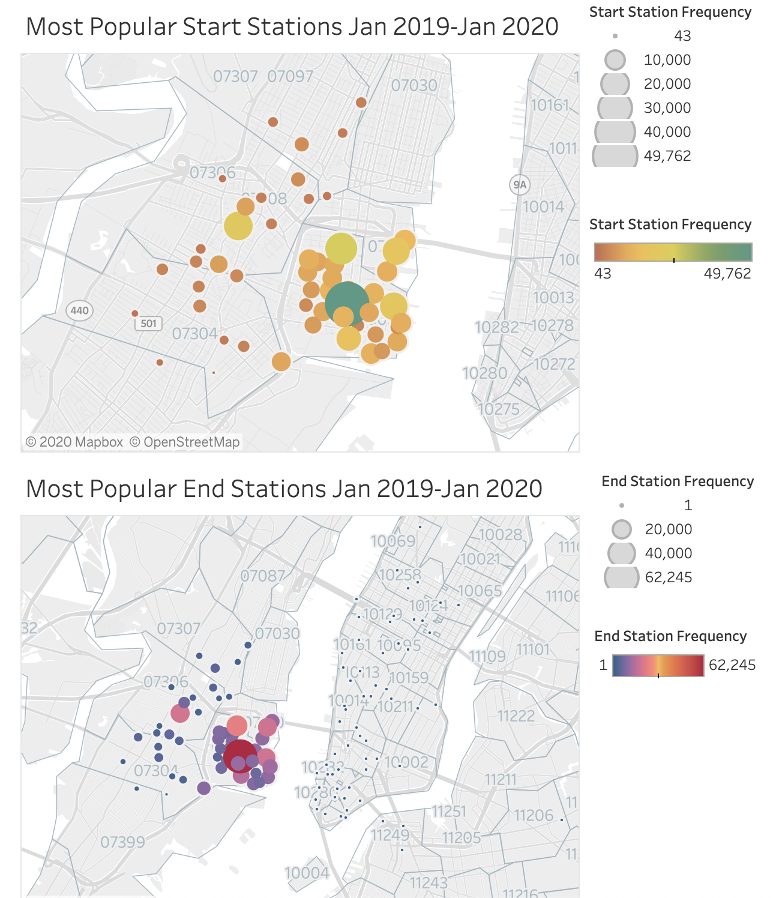

# Citi-Bike-Analysis-Tableau

Tableau Dashboards: https://public.tableau.com/profile/vito.perez7389#!/

## Bike Usage
#### By Age
There are outliers in the dataset because not all customers enter their actual year of birth which is why there are birth years going back from 1888 to 1918. There is a spike of ride duration for riders who entered their birth year as 1905 and 1969; these data points are not apparently useful because it is unlikely for a rider to be 100+ years old and the number ‘69’ is a modern gag. However, it is possible to infer that these users are in the younger age spectrum between 18-35, because older users have a different relationship to technology and are likely to enter their true birth year. 

Excluding outliers, it is common for riders 60 years or older to ride between 5-10 minutes. Riders born between 1971 and 1993 also ride between 5-10 minutes. Those born between 1995 and 2003 ride up to 20 to 30 minutes. Those born in 2000 have the highest ride duration on the younger side of the age spectrum, up to 40 minutes.

The most apparent trend is that younger riders tend to ride for longer periods of time.

#### By Gender
Looking at the gender breakdown of riders, we see the same spike for riders born in 1969; in addition, these riders do not report their gender. It is likely that a sizable amount of riders do not care to genuinely list their birth year and gender. With the exception of riders born in 1953, across the age spectrum there are more male riders than female. 

There are more female riders born between 1970 and 1995 than other age brackets. Both male and female riders indicate yearly seasonality: more people tend to ride during the spring and summer than fall and winter.

#### By Unit
The top 10 most used bike units have clocked in between 23,000 and 50,000 minutes. The least used have clocked in between 2-10 minutes. These bikes probably get dropped off on the least used end stations where nearly no one starts their rides. There are no notable spikes or dips; it seems there is a smooth, gradual increase of use from the least used to the most used bike unit.

## Subscriber vs Customer trips
Similar to the inference drawn from the gender/age plot, the majority of riders both subscribers and customers show a spike of use in the spring summer months and dips in the fall and winter. Although subscribers ride significantly more than customers, subscribers ride for shorter periods than customers. Customers are more likely to be tourists who want to explore whereas subscribers know where they need to go.

## Stations
Grove St. Path is the most popular station for riders to start and end their rides. Citi Bike riders gravitate to stations in the 07000 zip code area (Jersey City) to start their ride. Riders never start their rides in stations in the 10000 and 11000 zip code areas (Manhattan and Brooklyn, respectively) and rarely visit them to end their ride. This is most likely because the Statue of Liberty draws in riders, most likely tourists who are less familiar with the area. Hence, these riders are most likely tourists. Residents, being more familiar, are more likely to frequent the Manhattan and Brooklyn stations, and are therefore very likely to be subscribers.

